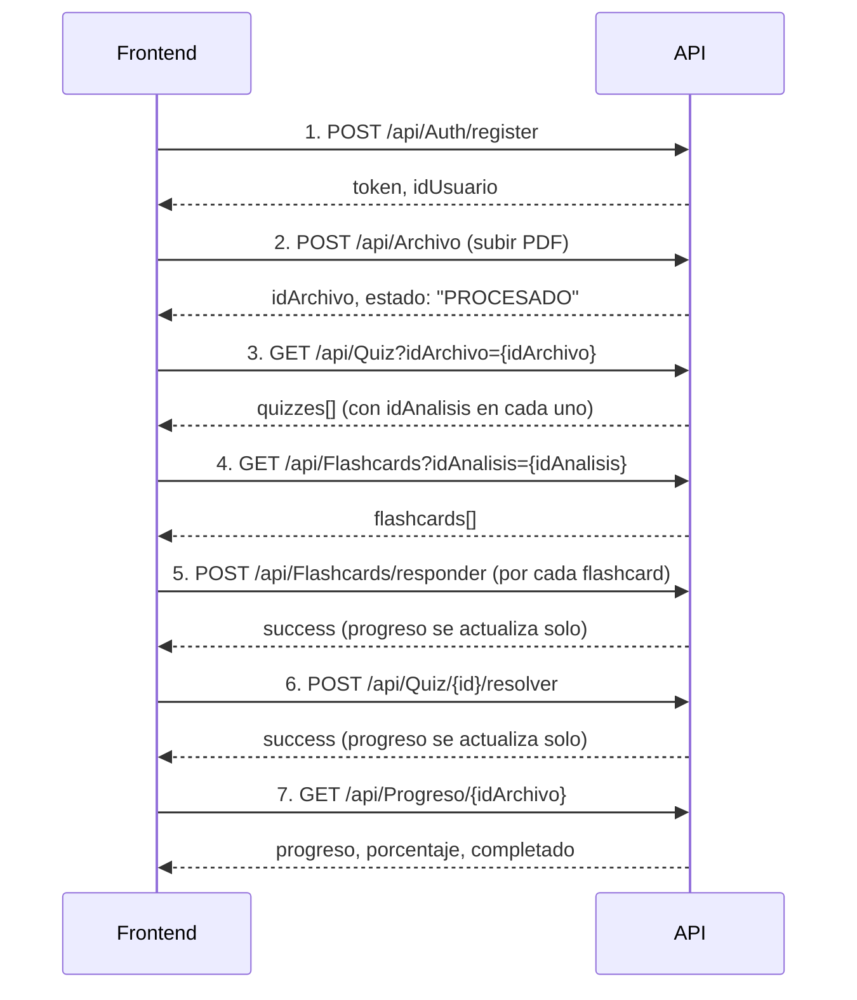

# Flashcards & Quizzes — API para Frontend

## Autenticación

Todas las rutas (excepto register/login) requieren un **Bearer token** JWT.

```
Authorization: Bearer eyJhbGciOiJI...
```

---

## 1. Registro / Login

### POST /api/Auth/register

```json
{
  "nombre": "Angel",
  "apellido": "Valdivia",
  "correo": "angel@gmail.com",
  "password": "Angel123!"
}
```

**Respuesta:**
```json
{
  "token": "eyJ...",
  "idUsuario": 1,
  "nombre": "Angel",
  "correo": "angel@gmail.com",
  "rol": "USER"
}
```

### POST /api/Auth/login

```json
{
  "correo": "angel@gmail.com",
  "password": "Angel123!"
}
```

**Respuesta:** igual que register.

---

## 2. Subir archivo (dispara la IA)

### POST /api/Archivo

`multipart/form-data` con campo `archivo` (.pdf o .txt)

**Respuesta:**
```json
{
  "idArchivo": 1,
  "nombreArchivo": "documento.pdf",
  "tipoArchivo": ".pdf",
  "tamanoMB": 1.25,
  "fechaSubida": "2026-05-24T03:00:00Z",
  "estado": "PROCESADO",
  "urlArchivo": "/assets/uploads/..."
}
```

El `idArchivo` se usa para obtener los quizzes.

---

## 3. Obtener quizzes de un archivo

### GET /api/Quiz?idArchivo={idArchivo}

**Respuesta:**
```json
[
  {
    "idQuiz": 1,
    "idAnalisis": 1,
    "titulo": "Quiz generado por IA",
    "descripcion": "Evaluación automática",
    "fechaCreacion": "2026-05-24T03:00:00Z",
    "preguntas": [
      {
        "idPreguntaQuiz": 1,
        "pregunta": "¿Cuál es el tema principal?",
        "opcionA": "Opción A",
        "opcionB": "Opción B",
        "opcionC": "Opción C",
        "opcionD": "Opción D"
      }
    ]
  }
]
```

> **Nota:** `opcionC` y `opcionD` pueden ser `null` si el quiz solo tiene 2 opciones.
> **Nota:** `idAnalisis` te sirve para obtener las flashcards del archivo.

---

## 4. Obtener flashcards de un análisis

### GET /api/Flashcards?idAnalisis={idAnalisis}

**Respuesta:**
```json
[
  {
    "idFlashcard": 1,
    "pregunta": "¿Quién emite la carta?",
    "respuesta": "UPN sede Cajamarca",
    "nivelDificultad": "MEDIO",
    "vecesEstudiada": 0
  }
]
```

---

## 5. Responder una flashcard

### POST /api/Flashcards/responder

```json
{
  "idFlashcard": 1,
  "correcta": true,
  "tiempoRespuestaSegundos": 5
}
```

**Respuesta:**
```json
{
  "success": true,
  "mensaje": "Flashcard respondida correctamente."
}
```

> **Importante:** Al responder, el progreso del archivo se actualiza automáticamente. No necesitas llamar a otro endpoint.

---

## 6. Resolver un quiz

### POST /api/Quiz/{idQuiz}/resolver

```json
{
  "correctas": 4,
  "incorrectas": 1,
  "puntaje": 80.0,
  "tiempoMinutos": 5
}
```

**Respuesta:**
```json
{
  "success": true,
  "mensaje": "Quiz resuelto correctamente."
}
```

> **Importante:** Al resolver, el progreso del archivo se actualiza automáticamente. No necesitas llamar a otro endpoint.

---

## 7. Consultar progreso

### GET /api/Progreso/{idArchivo}

**Respuesta:**
```json
{
  "idProgresoArchivo": 1,
  "idUsuario": 1,
  "idArchivo": 1,
  "flashcardsCompletadas": 3,
  "flashcardsTotales": 5,
  "quizzesCompletados": 1,
  "quizzesTotales": 1,
  "porcentajeProgreso": 66.67,
  "promedioPuntaje": 80.0,
  "completado": false,
  "ultimaSesion": "2026-05-24T03:05:00Z"
}
```

> `completado` es `true` cuando `porcentajeProgreso >= 100`.

### GET /api/Progreso

Lista el progreso de todos los archivos del usuario autenticado.

### GET /api/Progreso/{idArchivo}/promedio

```json
{
  "idArchivo": 1,
  "promedioQuiz": 80.0
}
```

---

## 8. Obtener todas las flashcards (singular)

### GET /api/Flashcards/{idFlashcard}

```json
{
  "idFlashcard": 1,
  "pregunta": "¿Quién emite la carta?",
  "respuesta": "UPN sede Cajamarca",
  "nivelDificultad": "MEDIO",
  "vecesEstudiada": 0
}
```

---

## Flujo recomendado para el Frontend



### Pasos en texto:

1. **Registrar** o **loguear** al usuario -> guardar token
2. **Subir archivo** (.pdf o .txt) -> la IA lo procesa y genera flashcards + quizzes
3. **Obtener quizzes** con `GET /api/Quiz?idArchivo={idArchivo}` -> de aquí sacas `idAnalisis`
4. **Obtener flashcards** con `GET /api/Flashcards?idAnalisis={idAnalisis}`
5. **Mostrar flashcards** al usuario -> cuando responda, llamar a `POST /api/Flashcards/responder`
6. **Mostrar quizzes** al usuario -> cuando termine, llamar a `POST /api/Quiz/{id}/resolver`
7. **Consultar progreso** con `GET /api/Progreso/{idArchivo}` cuando quieras mostrar el avance

---

## Cálculo del Progreso

```
porcentajeProgreso = (flashcardsCompletadas + quizzesCompletados)
                     / (flashcardsTotales + quizzesTotales)
                     * 100

completado = porcentajeProgreso >= 100
```

- **flashcardsCompletadas**: número de flashcards **distintas** que el usuario ha respondido (sin importar si fue correcta o incorrecta).
- **quizzesCompletados**: número de quizzes **distintos** que el usuario ha enviado.
- El progreso se recalcula automáticamente en cada respuesta de flashcard o resolución de quiz.

---

## Diagrama de base de datos (relaciones)

```
ArchivoSubido (idArchivo)
       │
       ▼
AnalisisIA (idAnalisis, idArchivo)
       │
       ├──► Flashcard (idFlashcard, idAnalisis)
       │         │
       │         └──► HistorialFlashcard (idUsuario, idFlashcard, correcta)
       │
       └──► Quiz (idQuiz, idAnalisis)
                 │
                 ├──► PreguntaQuiz (idPreguntaQuiz, idQuiz)
                 │
                 └──► HistorialQuiz (idUsuario, idQuiz, puntaje, correctas, incorrectas)
```
